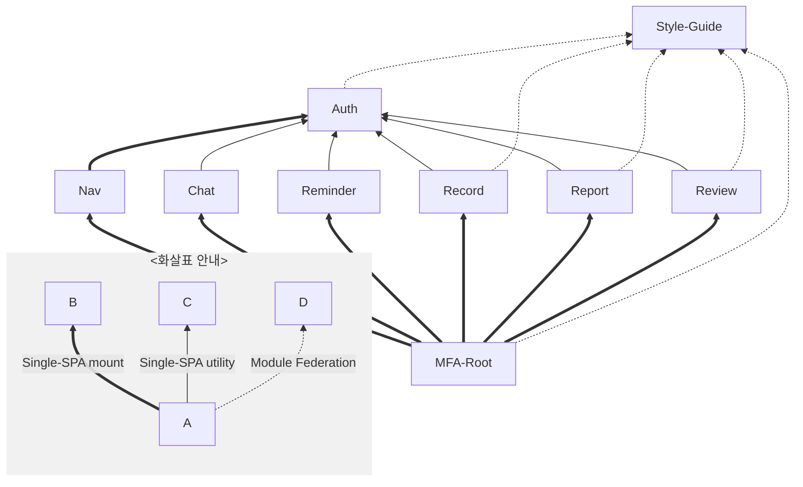

# 마이크로 프론트엔드 통합

> Single-Spa Root 구성

## 🛠️ 기술 스택

[](https://single-spa.js.org/)
[![Module Federation](https://img.shields.io/badge/Module_Federation-bfeaf9.svg?logo=data:image/svg+xml;base64,PHN2ZyB4bWxucz0iaHR0cDovL3d3dy53My5vcmcvMjAwMC9zdmciIGZpbGw9Im5vbmUiIHZpZXdCb3g9IjAgMCAxNTkgMTUyIj4KICA8cGF0aCBzdHJva2U9IiMxMDhDQjkiIHN0cm9rZS1taXRlcmxpbWl0PSIxMCIgc3Ryb2tlLXdpZHRoPSIzLjIiIGQ9Ik05Ni4zIDEyLjcgNzkgMy4ybS0xNyA5LjYgMTctOS42bTE3LjMgMTM2LjFMNzkgMTQ4LjhtLTE3LTkuNiAxNy4xIDkuNk0zMi43IDI5LjYgMTYgMzkuOG0tLjMgMTkuNi4yLTE5LjZtLjEgMC0xMy44LThtMTQwLjQgNjAuOS0uMyAxOS42bS0xNi45IDEwLjEgMTYuOS0xMC4xbTAgMCAxMy43IDcuOU0xNS43IDkzbC40IDE5LjVNMzMgMTIyLjZsLTE3LTEwbTAtLjEtMTMuNiA4bTEyMi45LTkxLjEgMTYuOCAxMC4ybS4zIDE5LjYtLjMtMTkuNm0wIDAgMTMuNy04Ii8+CiAgPHBhdGggZmlsbD0iIzk1ODlFQyIgZD0iTTk2LjUgNDMuMyA3OSAzMy4zbC0xNy41IDEwTDc5IDUzLjRsMTcuNS0xMFoiLz4KICA8cGF0aCBmaWxsPSIjMUMyMTM1IiBkPSJNNzkgMzIuOCA2MS4yIDQzLjF2MjAuNkw3OSA3NC4xbDE4LTEwLjRWNDMuMUw3OSAzMi44Wm0xNi44IDEwLjVMNzkgNTNsLTE2LjctOS43TDc5IDMzLjdsMTYuOCA5LjZabS0zMy45LjcgMTYuNyA5LjZWNzNMNjIgNjMuM1Y0NFptMTcuNSAyOVY1My41TDk2LjEgNDR2MTkuM2wtMTYuNyA5LjZaIi8+CiAgPHBhdGggZmlsbD0iIzk1ODlFQyIgZD0iTTU5LjggMTA3LjRWODcuMkw0Mi40IDc3djIwLjJsMTcuNCAxMFoiLz4KICA8cGF0aCBmaWxsPSIjMUMyMTM1IiBkPSJNNTkuOCA2Ni42IDQyIDc2Ljl2MjAuNmwxNy44IDEwLjMgMTgtMTAuM1Y3Ni45bC0xOC0xMC4zWk03Ni42IDc3bC0xNi44IDkuNkw0My4xIDc3bDE2LjctOS43TDc2LjYgNzdabS0zMy45LjcgMTYuOCA5LjZ2MTkuM0w0Mi43IDk3Vjc3LjhabTE3LjUgMjguOVY4Ny40TDc3IDc3LjhWOTdsLTE2LjcgOS43WiIvPgogIDxwYXRoIGZpbGw9IiM5NTg5RUMiIGQ9Ik05OC4yIDEwNy40Vjg3LjJMMTE1LjcgNzd2MjAuMmwtMTcuNSAxMFoiLz4KICA8cGF0aCBmaWxsPSIjMUMyMTM1IiBkPSJNOTguMiA2Ni42IDgwLjMgNzYuOXYyMC42bDE4IDEwLjNMMTE2IDk3LjVWNzYuOUw5OC4yIDY2LjZaTTExNSA3N2wtMTYuNyA5LjZMODEuNiA3N2wxNi43LTkuN0wxMTUgNzdabS0zMy44LjcgMTYuNyA5LjZ2MTkuM0w4MS4yIDk3Vjc3LjhabTE3LjUgMjguOVY4Ny40bDE2LjctOS42Vjk3bC0xNi43IDkuNloiLz4KICA8cGF0aCBmaWxsPSIjOTU4OUVDIiBkPSJtMTE1LjcgNTQuOC0xNy41LTEwLTE3LjUgMTBMOTguMiA2NWwxNy41LTEwWiIvPgogIDxwYXRoIGZpbGw9IiM5NTg5RUMiIGQ9Ik05OC4yIDg1LjFWNjVsMTcuNS0xMHYyMEw5OC4yIDg1LjFaIi8+CiAgPHBhdGggZmlsbD0iIzFDMjEzNSIgZD0iTTk4LjIgNDQuMyA4MC4zIDU0LjZ2MjAuNmwxOCAxMC40TDExNiA3NS4yVjU0LjZMOTguMiA0NC4zWk0xMTUgNTQuOGwtMTYuNyA5LjctMTYuNy05LjcgMTYuNy05LjYgMTYuNyA5LjZabS0zMy44LjcgMTYuNyA5Ljd2MTkuM2wtMTYuNy05LjdWNTUuNVptMTcuNSAyOVY2NS4ybDE2LjctOS43djE5LjNsLTE2LjcgOS43WiIvPgogIDxwYXRoIGZpbGw9IiM5NTg5RUMiIGQ9Im03Ny4zIDU0LjgtMTcuNS0xMC0xNy40IDEwTDU5LjggNjVsMTcuNS0xMFpNNTkuOCA4NS4xVjY1TDQyLjQgNTV2MjBsMTcuNCAxMC4xWiIvPgogIDxwYXRoIGZpbGw9IiMxQzIxMzUiIGQ9Ik01OS44IDQ0LjMgNDIgNTQuNnYyMC42bDE3LjggMTAuNCAxOC0xMC40VjU0LjZsLTE4LTEwLjNabTE2LjggMTAuNS0xNi44IDkuNy0xNi43LTkuNyAxNi43LTkuNiAxNi44IDkuNlptLTMzLjkuNyAxNi44IDkuN3YxOS4zbC0xNi44LTkuN1Y1NS41Wm0xNy41IDI5VjY1LjJMNzcgNTUuNXYxOS4zbC0xNi43IDkuN1oiLz4KICA8cGF0aCBmaWxsPSIjOTU4OUVDIiBkPSJNNzkgMTE4LjVWOTguM2wtMTcuNS0xMHYyMC4xbDE3LjUgMTBabTAgMFY5OC4zbDE3LjUtMTB2MjAuMWwtMTcuNSAxMFoiLz4KICA8cGF0aCBmaWxsPSIjMUMyMTM1IiBkPSJNNzkgNzcuNyA2MS4yIDg4djIwLjZMNzkgMTE5bDE4LTEwLjRWODhMNzkgNzcuN1ptMTYuOCAxMC41TDc5IDk4bC0xNi43LTkuN0w3OSA3OC42bDE2LjggOS42Wm0tMzMuOS43IDE2LjcgOS42djE5LjNMNjIgMTA4LjJWODguOVptMTcuNSAyOVY5OC40TDk2LjEgODl2MTkuM2wtMTYuNyA5LjZaIi8+CiAgPHBhdGggZmlsbD0iIzcxQkVEQiIgZD0iTTEzNC41IDQzLjIgODAgMTEuNnYyMEwxMTcuMyA1M2wxNy4yLTEwWm0tOTMuNyAxMCAzNy41LTIxLjdWMTEuNkwyMy41IDQzLjJsMTcuMyAxMFptNzcuMiAxLjN2NDMuM2wxNy4zIDEwVjQ0LjRsLTE3LjMgMTBabS03Ny44LjEtMTcuMy0xMHY2M2wxNy4zLTEwdi00M1pNMjMuNyAxMDlsNTQuNiAzMS40di0yMEw0MSA5OWwtMTcuMyAxMFptNTYuMiAxMS41djIwbDU0LjUtMzEuNUwxMTcgOTlsLTM3IDIxLjVaIi8+CiAgPHBhdGggZmlsbD0iIzk1ODlFQyIgZD0iTTk2LjUgNjYuNCA3OSA1Ni4zbC0xNy41IDEwTDc5IDc2LjVsMTcuNS0xMFoiLz4KICA8cGF0aCBmaWxsPSIjOTU4OUVDIiBkPSJNNzkgOTYuNlY3Ni40bC0xNy41LTEwdjIwLjFMNzkgOTYuNlptMCAwVjc2LjRsMTcuNS0xMHYyMC4xTDc5IDk2LjZaIi8+CiAgPHBhdGggZmlsbD0iIzFDMjEzNSIgZD0iTTc5IDU1LjggNjEuMiA2Ni4xdjIwLjdMNzkgOTdsMTgtMTAuMlY2Nkw3OSA1NS44Wm0xNi44IDEwLjZMNzkgNzZsLTE2LjctOS42TDc5IDU2LjdsMTYuOCA5LjdabS0zMy45LjYgMTYuNyA5LjdWOTZMNjIgODYuM1Y2N1ptMTcuNSAyOVY3Ni43TDk2LjEgNjd2MTkuM0w3OS40IDk2WiIvPgo8L3N2Zz4K&style=flat-square&logoColor)](https://single-spa.js.org/)  
[](https://ejs.co/)
[](https://webpack.kr/)

## 프로젝트 의존 그래프

### 개괄



- 노드 클릭 시 각 프로젝트 이동
- 연관 관계는 [Single-SPA](https://single-spa.js.org/)와 [Module Federation](https://module-federation.io/)

### 개요

```mermaid
flowchart BT
    %% 스타일 및 컴포넌트 공유
    subgraph styleguide[@pickme/style-guide]
        subgraph styles["/styles"]
            styleguide/styles/global.ts[global.css]
        end
        subgraph vue["/vue-components"]
            styleguide/vue/components[Shared Components]
        end
        subgraph react["/react-components"]
            styleguide/react/chakra-ui-system.jsx[chakra-ui-system.jsx]
            styleguide/react/components[Shared Components]
        end
    end

    %% Single-SPA Parcel 앱
    subgraph auth[@pickme/auth]
        auth/ChakraProvider[ChakraProvider]
    end
    auth/ChakraProvider -.-> styleguide/react/chakra-ui-system.jsx

    %% Svelte 앱
    subgraph nav[@pickme/nav]
        nav/auth[parcel/auth]
    end
    nav/auth ==>|object| auth

    %% React 앱
    subgraph record[@pickme/record]
        record/ChakraProvider[ChakraProvider]
        record/Components[Components]
    end
    record:::delegate -->|utility| auth
    record/ChakraProvider -.-> styleguide/react/chakra-ui-system.jsx
    record/Components -.-> styleguide/react/components

    %% Vue 앱
    subgraph report[@pickme/report]
        report/Components[Components]
    end
    report:::delegate -->|utility| auth
    report/Components -.-> styleguide/vue/components

    %% Microfrontend 루트 앱
    subgraph mfa-root[@pickme/mfa-root]
        mfa-root/microfrontend-layout.html[microfrontend-layout.html]
        mfa-root/index.ejs[index.ejs]
    end
    mfa-root ==> nav
    mfa-root ==> record
    mfa-root ==> report
    mfa-root/index.ejs -.-> styleguide/styles/global.ts

    %% 대표 앱 표시
    classDef delegate stroke-width:3px;
```

- 각 애플리케이션(Nav, Chat, Reminder, Record, Report, Review)들은 mfa-root에서 Single-SPA 애플리케이션으로써 동적 호출됨.
- Auth는 Nav에 Single-SPA 파셀로써 동적 호출됨.
- Auth는 각 애플리케이션들에 유틸리티로써 동적 호출됨.
- Style-Guide는 MFA-Root에 스타일 제공을 위해 Module Federation으로 동적 호출됨.
- Style-Guide는 각 애플리케이션에 공유 컴포넌트 제공을 위해 Module Federation으로 동적 호출됨.
