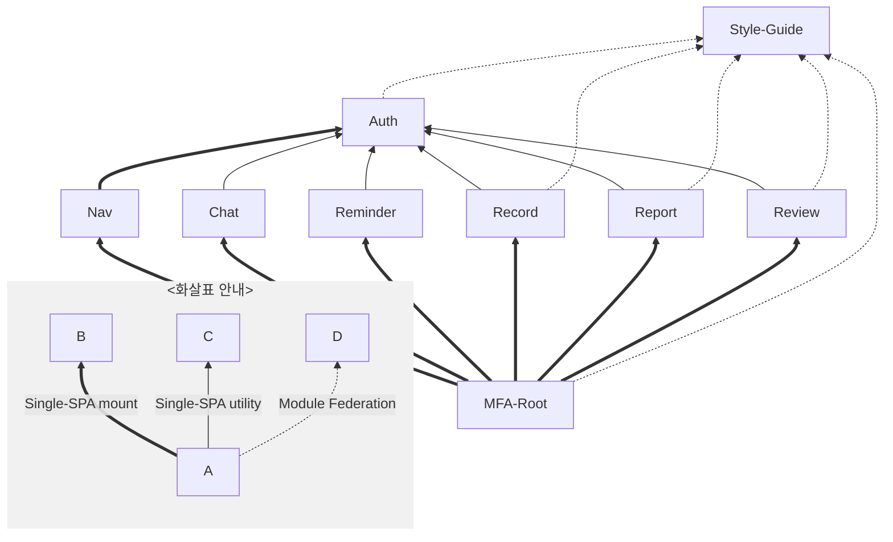

## 프로젝트 의존 그래프

### 개괄



- 노드 클릭 시 각 프로젝트 이동
- 연관 관계는 [Single-SPA](https://single-spa.js.org/)와 [Module Federation](https://module-federation.io/)

### 개요

```mermaid
flowchart BT
    %% 스타일 및 컴포넌트 공유
    subgraph styleguide[@pickme/style-guide]
        subgraph styles["/styles"]
            styleguide/styles/global.ts[global.css]
        end
        subgraph vue["/vue-components"]
            styleguide/vue/components[Shared Components]
        end
        subgraph react["/react-components"]
            styleguide/react/chakra-ui-system.jsx[chakra-ui-system.jsx]
            styleguide/react/components[Shared Components]
        end
    end

    %% Single-SPA Parcel 앱
    subgraph auth[@pickme/auth]
        auth/ChakraProvider[ChakraProvider]
    end
    auth/ChakraProvider -.-> styleguide/react/chakra-ui-system.jsx

    %% Svelte 앱
    subgraph nav[@pickme/nav]
        nav/auth[parcel/auth]
    end
    nav/auth ==>|object| auth

    %% React 앱
    subgraph record[@pickme/record]
        record/ChakraProvider[ChakraProvider]
        record/Components[Components]
    end
    record:::delegate -->|utility| auth
    record/ChakraProvider -.-> styleguide/react/chakra-ui-system.jsx
    record/Components -.-> styleguide/react/components

    %% Vue 앱
    subgraph report[@pickme/report]
        report/Components[Components]
    end
    report:::delegate -->|utility| auth
    report/Components -.-> styleguide/vue/components

    %% Microfrontend 루트 앱
    subgraph mfa-root[@pickme/mfa-root]
        mfa-root/microfrontend-layout.html[microfrontend-layout.html]
        mfa-root/index.ejs[index.ejs]
    end
    mfa-root ==> nav
    mfa-root ==> record
    mfa-root ==> report
    mfa-root/index.ejs -.-> styleguide/styles/global.ts

    %% 대표 앱 표시
    classDef delegate stroke-width:3px;
```

- 각 애플리케이션(Nav, Chat, Reminder, Record, Report, Review)들은 mfa-root에서 Single-SPA 애플리케이션으로써 동적 호출됨.
- Auth는 Nav에 Single-SPA 파셀로써 동적 호출됨.
- Auth는 각 애플리케이션들에 유틸리티로써 동적 호출됨.
- Style-Guide는 MFA-Root에 스타일 제공을 위해 Module Federation으로 동적 호출됨.
- Style-Guide는 각 애플리케이션에 공유 컴포넌트 제공을 위해 Module Federation으로 동적 호출됨.
