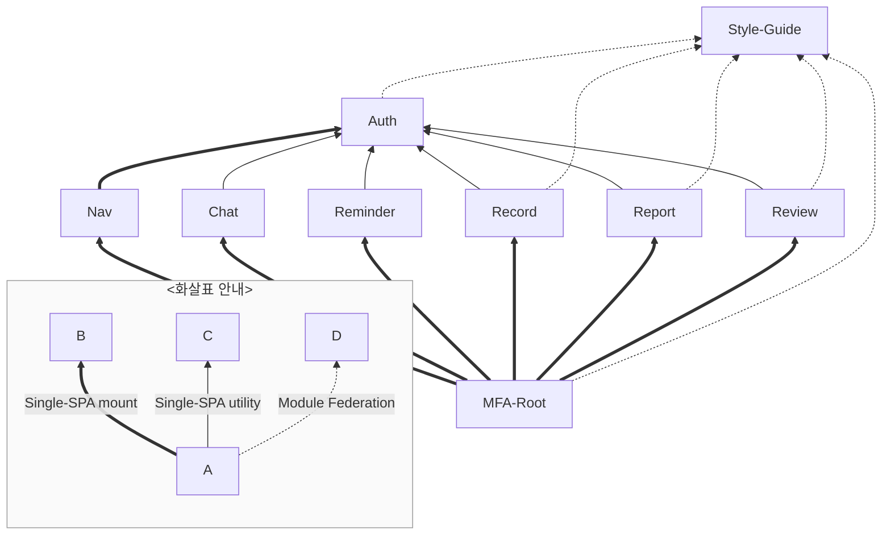
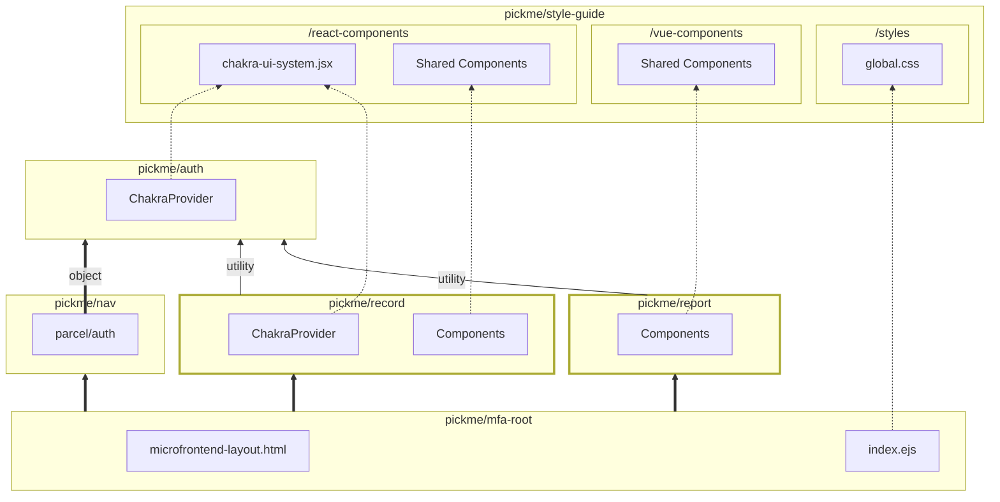

# 마이크로 프론트엔드 통합

> Single-Spa Root 구성

## 🛠️ 기술 스택

[](https://single-spa.js.org/)
[![Module Federation](https://img.shields.io/badge/Module_Federation-6C63FF.svg?logo=data:image/svg+xml;base64,PHN2ZyB4bWxucz0iaHR0cDovL3d3dy53My5vcmcvMjAwMC9zdmciIGZpbGw9ImN1cnJlbnRDb2xvciIgdmlld0JveD0iMCAwIDQzIDQwIj48cGF0aCBmaWxsPSIjRkZGIiBkPSJNMjEuNS41IDI2LjEgM2wtLjIuM0wyMS40LjhsLjEtLjNaIi8+PHBhdGggZmlsbD0iI0ZGRiIgZD0iTTIxLjUuOCAxNyAzLjNsLS4xLS4yTDIxLjQuNWwuMS4zWk0yMS40IDM5LjJsNC41LTIuNS4yLjMtNC42IDIuNS0uMS0uM1oiLz48cGF0aCBmaWxsPSIjRkZGIiBkPSJtMjEuNCAzOS41LTQuNi0yLjYuMS0uMiA0LjYgMi41LS4xLjNaTTQuNSAxMC4yIDkgNy41bC4yLjMtNC41IDIuNy0uMi0uM1oiLz48cGF0aCBmaWxsPSIjRkZGIiBkPSJtNC44IDEwLjQtLjEgNS4yaC0uM3YtNS4yaC40WiIvPjxwYXRoIGZpbGw9IiNGRkYiIGQ9Im0xIDguMSAzLjcgMi4xLS4yLjNMMSA4LjRsLjEtLjNaTTM4LjEgMjkuNmwuMS01LjJoLjN2NS4ySDM4WiIvPjxwYXRoIGZpbGw9IiNGRkYiIGQ9Im0zOC4zIDI5LjgtNC41IDIuNy0uMS0uMyA0LjUtMi43LjEuM1oiLz48cGF0aCBmaWxsPSIjRkZGIiBkPSJtNDEuOCAzMS45LTMuNi0yLjEuMS0uMyAzLjcgMi4xLS4yLjNaTTQuNSAyOS43bC0uMS01LjJoLjN2NS4yaC0uMloiLz48cGF0aCBmaWxsPSIjRkZGIiBkPSJtNC43IDI5LjYgNC41IDIuNy0uMS4yLTQuNS0yLjcuMS0uMloiLz48cGF0aCBmaWxsPSIjRkZGIiBkPSJtMSAzMS43IDMuNi0yLjEuMS4yTDEuMSAzMmwtLjItLjNaTTM4LjIgMTAuNGwtNC41LTIuNy4xLS4yIDQuNSAyLjctLjEuMloiLz48cGF0aCBmaWxsPSIjRkZGIiBkPSJNMzguNCAxMC4zdjUuMmgtLjJsLS4xLTUuMmguM1oiLz48cGF0aCBmaWxsPSIjRkZGIiBkPSJtNDIgOC4zLTMuNyAyLjEtLjEtLjJMNDEuOCA4bC4yLjJaIi8+PHBhdGggZmlsbD0iIzk1ODlFQSIgZD0ibTI2IDExLjMtNC42LTIuNy00LjYgMi43IDQuNiAyLjcgNC43LTIuN1pNMTYuMyAyOC4zVjIzbC00LjctMi43djUuNGw0LjcgMi42Wk0yNi41IDI4LjNWMjNsNC43LTIuN3Y1LjRsLTQuNyAyLjZaTTMxLjIgMTQuNGwtNC43LTIuNy00LjYgMi43IDQuNiAyLjcgNC43LTIuN1oiLz48cGF0aCBmaWxsPSIjOTU4OUVBIiBkPSJNMjYuNSAyMi40di01LjNsNC43LTIuN3Y1LjNsLTQuNyAyLjdaTTIxIDE0LjRsLTQuNy0yLjctNC43IDIuNyA0LjcgMi43IDQuNy0yLjdaIi8+PHBhdGggZmlsbD0iIzk1ODlFQSIgZD0iTTE2LjMgMjIuNHYtNS4zbC00LjctMi43djUuM2w0LjcgMi43Wk0yMS40IDMxLjN2LTUuNGwtNC42LTIuN3Y1LjRsNC42IDIuN1pNMjEuNCAzMS4zdi01LjRsNC43LTIuN3Y1LjRsLTQuNyAyLjdaIi8+PHBhdGggZmlsbD0iI0ZGRiIgZD0iTTM2LjIgMTEuMyAyMS42IDIuOXY1LjNsMTAgNS43IDQuNi0yLjZaTTExLjIgMTRsMTAtNS44VjIuOUw2LjYgMTEuM2w0LjYgMi42Wk0zMS44IDE0LjN2MTEuNWw0LjYgMi42VjExLjZsLTQuNiAyLjdaTTExIDE0LjNsLTQuNS0yLjZ2MTYuN2w0LjYtMi43VjE0LjNaTTYuNyAyOC43bDE0LjUgOC40di01LjNsLTEwLTUuNy00LjUgMi42Wk0yMS42IDMxLjh2NS4zbDE0LjYtOC4zLTQuNi0yLjctMTAgNS43WiIvPjxwYXRoIGZpbGw9IiM5NTg5RUEiIGQ9Im0yNiAxNy40LTQuNi0yLjctNC42IDIuNyA0LjYgMi43IDQuNy0yLjdaIi8+PHBhdGggZmlsbD0iIzk1ODlFQSIgZD0iTTIxLjQgMjUuNVYyMGwtNC42LTIuN3Y1LjRsNC42IDIuN1pNMjEuNCAyNS41VjIwbDQuNy0yLjd2NS40bC00LjcgMi43WiIvPjwvc3ZnPg==&style=flat-square&logoColor)](https://module-federation.io/)  
[](https://ejs.co/)
[](https://webpack.kr/)

## 💡 주요 기능

1. **Single-Spa Root**

   - Single-SPA 응용 프로그램을 시작하는 루트 HTML
   - `singleSpa.registerApplication`을 호출

2. **Single-SPA**

   - 여러 JavaScript 마이크로프론트엔드를 동적으로 통합하는 프레임워크
   - 페이지 새로고침 없이 Vue, Svelte, React 등 프레임워크 사용
   - 마이크로프론트엔드를 독립적으로 개발 및 배포 가능
   - Application, Parcel, Root로 구분

     - 각 싱글페이지를 책임 단위로 나누어 서로 다른 프레임워크로 구현 및 배포

3. **Module Federation**

   - Webpack 5 기반의 탈중앙화 아키텍처 패턴
   - 애플리케이션 간 코드 및 리소스 공유
   - 런타임에서 원격 모듈을 동적으로 로드
   - Remote와 Host로 구분

     - 스타일가이드를 공유하기 위해 사용

## 🧩 마이크로 프론트 애플리케이션 구성


## 📦 프로젝트 의존 그래프

### 개괄



- 노드 클릭 시 각 프로젝트 이동
- 연관 관계는 [Single-SPA](https://single-spa.js.org/)와 [Module Federation](https://module-federation.io/)

- svelte: _Nav_
- vue: _Report_, _Chat_
- react: _Auth_, _Record_, _Review_

### 개요



- 각 애플리케이션(_Nav_, _Chat_, _Reminder_, _Record_, _Report_, _Review_)들은 **MFA-Root**에서 Single-SPA 애플리케이션으로써 동적 호출됨.
- *Auth*는 *Nav*에 Single-SPA 파셀로써 동적 호출됨.
- *Auth*는 각 애플리케이션들에 유틸리티로써 동적 호출됨.
- **Style-Guide**는 MFA-Root에 스타일 제공을 위해 Module Federation으로 동적 호출됨.
- *Style-Guide*는 각 애플리케이션에 공유 컴포넌트 제공을 위해 Module Federation으로 동적 호출됨.

## 🏗️ 아키텍처 다이어그램


1. 각 마이크로프론트엔드는 _GitHub Actions_ CI/CD를 통해 빌드되어 *S3*에 정적 파일로 저장됨.
2. *CloudFront*가 *S3*의 정적 파일을 CDN으로 배포함.
3. Importmap 타입의 JSON을 *CloudFront*를 통해 배포하여 동적 리소스 매핑 제공.
4. Root 프로젝트의 레포지토리 변경 사항을 *Amplify*가 감지하여 자동 배포함.
5. 사용자가 _Route53_ DNS로 접근하면 *Amplify*가 루트 파일을 클라이언트에 전송함.
6. 클라이언트는 Importmap을 통해 각 Single-SPA 리소스를 동적으로 불러옴.
7. `singleSpa.registerApplication`을 사용해 개별 마이크로프론트엔드를 동적으로 통합함.

## 🚀 실행 방법

### 환경변수

```python
IMPORT_MAPS_URL= # 개별 애플리케이션 리소스 매핑 주소
```

### 서버 실행

```sh
$ npm run start
```
